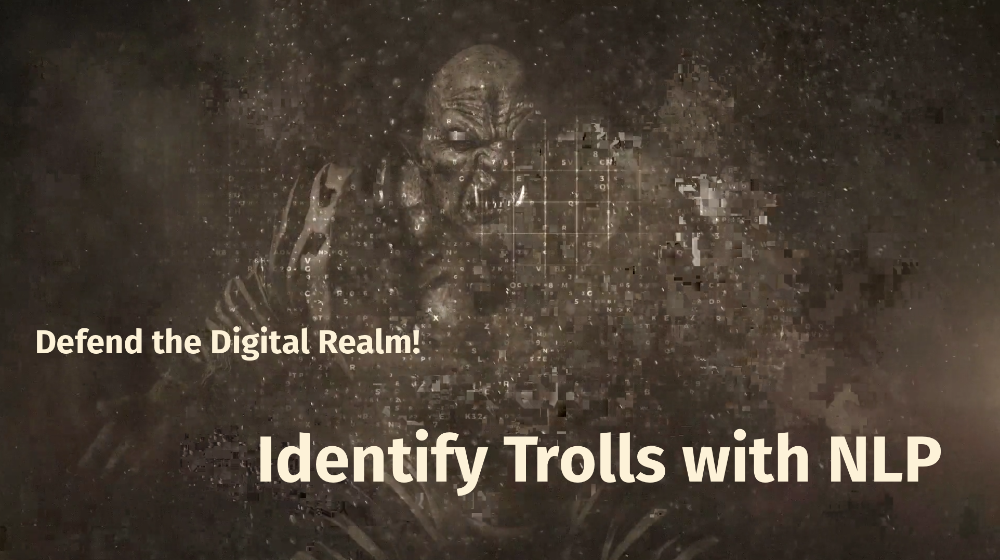

# Hack The Future 2020

## Introduction

The One Code is being spread all over the internet. Behind it all is an elusive
group of loathsome humanoids that call themselves the Trolls. Lately, they have
taken over one of the most sacred corners of the internet: Reddit. By injecting
malicious code into code examples on subreddits related to programming, the
Trolls were able to trick unwitting copy-pasters into executing the One Code on
their own machines. When the Trolls learned that our forensics department was
onto them, they tried to cover their tracks by mangling the original Reddit
posts, stripping away all but the first words. The comments section, which was
left untouched, now tells a tale of anguish and woe, as victims mourn for the 
loss of countless unbacked-up meme collections.

There's only good piece of news: Trolls can't lie about their name. If you can
identify the posts that were authored by a troll, you successfully unmask the
trolls. Give us their names, and we'll handle the part where they get nuked
from orbit.

Ready?

### Here's what we know from our forensics team

- Trolls submitted posts to programming-related subreddits containing malicious
  code.
- Trolls removed evidence to cover their tracks, leaving only the title, first
  few words of the body, and the comments section intact.
- Again to evade detection, Trolls mixed submissions from other subreddits (aka
  'cross-posted') into the programming-related subreddits. 
  - Initial analysis suggests that most of these outside posts originate from
    subreddits revolving around the literary genre fantasy, e.g. Lord of the
Rings and Game of Thrones.
  - No instances of malicious code have been linked to posts from fantasy
    subreddits.
- Posts that contained malicious code triggered overwhelmingly angry reactions
  from other users. 

## How To Play

In three easy steps:

1. Find trolls in the dataset *reddit2020.htf.jsonl*, using the remaining datasets however you see fit.
2. Submit list of suspected Trolls to the troll identification API and review score returned.
3. Try to improve score by iterating on approach.

## The Troll Identification API

Once you have a list of users that you suspect of belonging to the Trolls group, POST it as JSON payload to the troll identification endpoint, as shown in the snippet below. (Each team will receive a unique api key at the start of the challenge.) The endpoint will return a score that gives an indication of two things: a) how many of the users in your list were actually Trolls, b) how close you are to finding all the Trolls in the dataset. (Experienced data scientists will recognize this as an alternate formulation of the widely used 'F-score' metric.)

```Python
import requests  # remember to install first

identification_endpoint = 'https://brainjar-intern.appspot.com/api/v1/troll_identifier'
header = {'api-key': ''}  # TODO: fill in your api-key/authentication token.

users = []  # TODO: Users that you suspect of belonging to the Trolls. List must contain at least 6 *unique* user names.
payload = {'users': users}

# send a post requests
r = requests.post(identification_endpoint, headers=header, json=payload)

# print out the status code
print(r.status_code)
# 200 --> New high score
# 418 --> Success, but no new high score
# 400 --> Too soon or improper payload

# Inspect JSON response
print(r.json())
```

Two important points:

1. Each list submitted to the troll identification endpoint must comprise *at least* 6 unique usernames. There is no maximum length, however.
2. To avoid brute-forcing (e.g. genetic algorithm approaches) each request is followed by a 1-minute cool-down period, during which any new requests will be blocked.

## Evaluation criteria

Your team will be evaluated based on the following criteria:

1. The highest score you are able to attain.
2. Your use of NLP methods (note: Deep Learning methods are not a hard requirement) and your ability to communicate insights about the data.
3. Your presentation at the end of the day.

## Tips

- Don't blindly fire off requests to the troll identification API. We can tell when you're doing that.
- Take your time. Study the data. Be one with the data.
- Have fun and be kind to your teammates! Teamwork makes the dream work.

